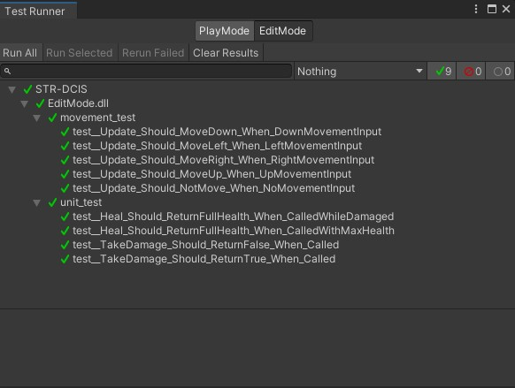
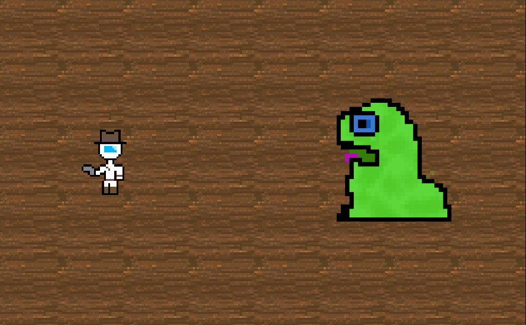

# Project Requirements

_Group 04 – “Galactic Gunslingers”\
Date: March 20, 2022\
Group Members: Caroline Fye, Jaron Bauers, Isaiah Raspet, Henry Fye, Jack Normand, Bronwyn Wedig_
## 1. Introduction
 Multiplayer games have been severely lacking in niche challenges nowadays and players are constantly looking for new ways to cure boredom. Galactic Gunslingers fills that void as a turn-based roguelike that allows gamers to tackle unique challenges with their friends every time they play. Features that have been created during our second implementation 

## 2. Implemented Requirements 
Requirement: "As a developer, I want to be able to test my code through automation so I can reduce the amount of bugs/mistakes being implemented in my code" \
Issue: N/A \
Pull request: https://github.com/CS386-Team4/STR-DCIS/pull/7 \
Implemented by: Jaron Bauers \
Approved by: Caroline Fye \
Print screen: 

Requirement: "As a gamer who wants to be entertained, I want variations in gameplay so I don't get bored from doing the same thing constantly." \
Issue: N/A \
Pull request: https://github.com/CS386-Team4/STR-DCIS/pull/10 \
Implemented by: Henry Fye \
Approved by: Jack Normand \
Print screen: 

## 3. Tests
*3.1.1*
- The framework used to develop our tests was the Unity Test Framework (UTF) which is the built in unit-testing framework in Unity.

*3.1.2*
- Link to our unit tests (https://github.com/CS386-Team4/STR-DCIS/tree/main/Source/STR-DCIS/Assets/Tests/EditMode)

*3.1.3*
- Test Case Example: In this example, we unit tested our user's movement functionality that will test the input entered by the user to make sure that the player is moving in the correct x and y axis, or if they are even moving at all.
- Class Being Tested (https://github.com/CS386-Team4/STR-DCIS/blob/main/Source/STR-DCIS/Assets/Scripts/PlayerMovement.cs)
- Unit Test (https://github.com/CS386-Team4/STR-DCIS/blob/main/Source/STR-DCIS/Assets/Tests/EditMode/PlayerMovement_test.cs)

*3.1.4*

## 4. Demo

## 5. Code Quality
In order to keep the level of high quality in our source code like we have, we came up with some best practice rules for code development:

1. All variable names will be descriptive.
2. All method/function names will be descriptive.
3. All class names will be descriptive.
4. Indents/Tabs are 4 spaces.
5. Everything within a set of curly braces will be indented once.
example: \
<pre>
someClass()
{
    someFunction()
    {
        someVar = True;
        if (someVar)
            return someVar;
    }
}
</pre>
6. All methods/functions will belong to a class.
7. KISS!!! (Keep it Simple Stupid)

## 6. Lessons Learned
In retrospective after this second release, some of our teammates have realized that working off of their own personal fork came with some integration problems and that creating a new branch off of main would have been a little more efficent. Moving forward with this project in the future, we will all be making new branches named after the User Story we are implementing to avoid these integration errors in the future. All in all, we will be working directly on the STR-DCIS repository instead of creating forks and working on a personal forked repository.
