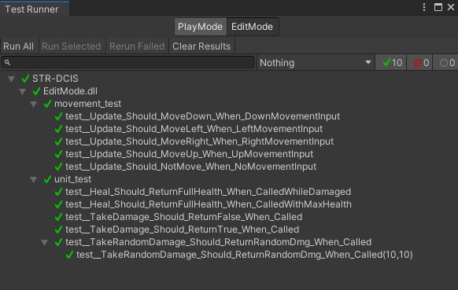

# Project Requirements

_Group 04 – “Galactic Gunslingers”\
Date: March 20, 2022\
Group Members: Caroline Fye, Jaron Bauers, Isaiah Raspet, Henry Fye, Jack Normand, Bronwyn Wedig_
## 1. Description
Galactic Gunslingers brings a never seen before gaming experience where you get to play as tough rootin tootin cowboys shootin in space. This game brings a unique spin to your favorite roguelike, dungeon crawler games by implementing both a realtime movement system and turned based combat. Users will have to either create an account or log into an already existing one, that is saved in our server, in order to access the rest of the game. From there you can access our options menu where you can configure the setting to your liking, or just jump right into the game. Galatic Gunslingers has a playful feel to it thanks to its unique pixel/cartoonish art-style and old-westerny soundtrack that will really help immerse the users. This game will hopefully bring countless hours of gameplay with its strong replayability value when we start to add more than one level and when we add items the user will be able to collect throughout the game. You and your friends will be able to play Galatic Gunslingers on your personal computer.

## 2. Verification (tests)

**Unit Test**

*2.1.1*
- The framework used to develop our tests was the Unity Test Framework (UTF) which is the built in unit-testing framework in Unity. In order to be able to carry out these "Mock" operations we had to import 4 different plugins from the [Moq website](https://www.nuget.org/packages/moq/).

*2.1.2*
- Link to our unit tests (https://github.com/CS386-Team4/STR-DCIS/tree/main/Source/STR-DCIS/Assets/Tests/EditMode)

*2.1.3*
- Test Case Example: In this example, we unit tested our random dmg generator class in that was added to our Unit c# file. This new class we added utilizes a "Stats" class where our random damage number is being generated. So in our unit test we tested our new class in we made in Unit c# file and mocked the "Stats" class object and manually set the random number generator through mocking it. Then finally made sure that was the correct number we expected.
- Class Being Tested (https://github.com/CS386-Team4/STR-DCIS/blob/main/Source/STR-DCIS/Assets/Scripts/Unit.cs)
- Unit Test (https://github.com/CS386-Team4/STR-DCIS/blob/main/Source/STR-DCIS/Assets/Tests/EditMode/unit_test.cs)

*2.1.4*

**Acceptance Test**

*2.2.1*
- The framework used to develop our tests was the Unity Test Framework (UTF) which is the built in unit-testing framework in Unity.

*2.2.2*
- Link to our unit tests (https://github.com/CS386-Team4/STR-DCIS/tree/main/Source/STR-DCIS/Assets/Tests/EditMode)

*2.2.3*
- Test Case Example: In this example, 
- Class Being Tested (https://github.com/CS386-Team4/STR-DCIS/blob/main/Source/STR-DCIS/Assets/Scripts/Unit.cs)
- Unit Test (https://github.com/CS386-Team4/STR-DCIS/blob/main/Source/STR-DCIS/Assets/Tests/EditMode/unit_test.cs)

*2.2.4*

## 3. Validation (user evaluation)
Script: The tasks we gave the user are the following
1. Explore the main menu
2. Explore the options menu
3. Start the game using the start button from the menu
4. Create user login credentials 
5. Log in with said credentials
6. Play around with character movement, explore level scene
7. Begin combat scene
8. Win, move to next scene
9. Explore the rest of the game at your own pace

